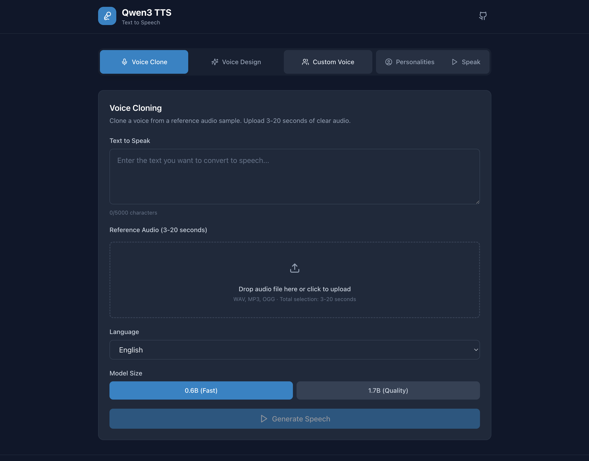
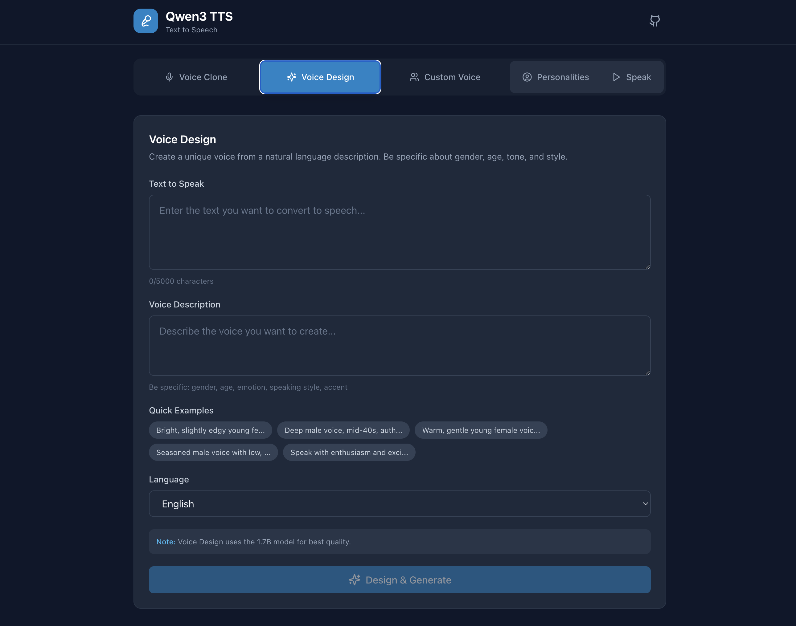
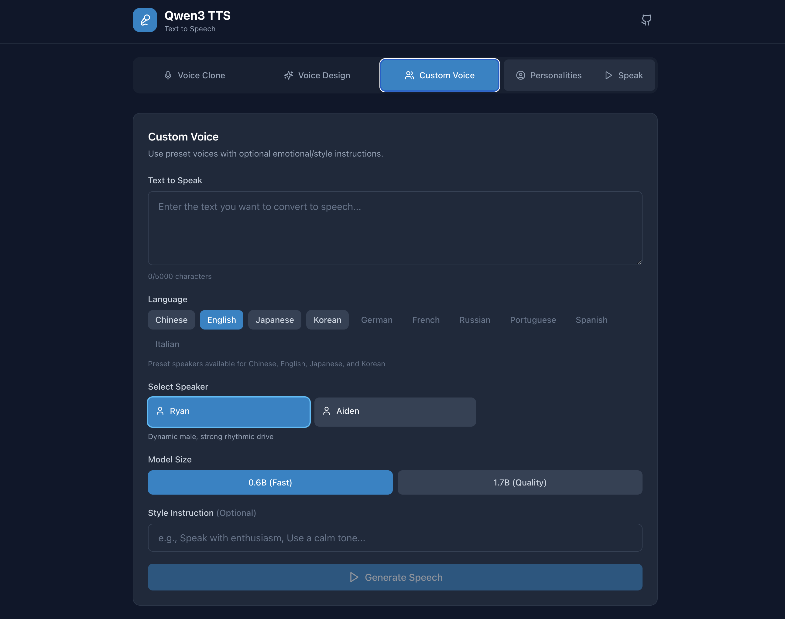
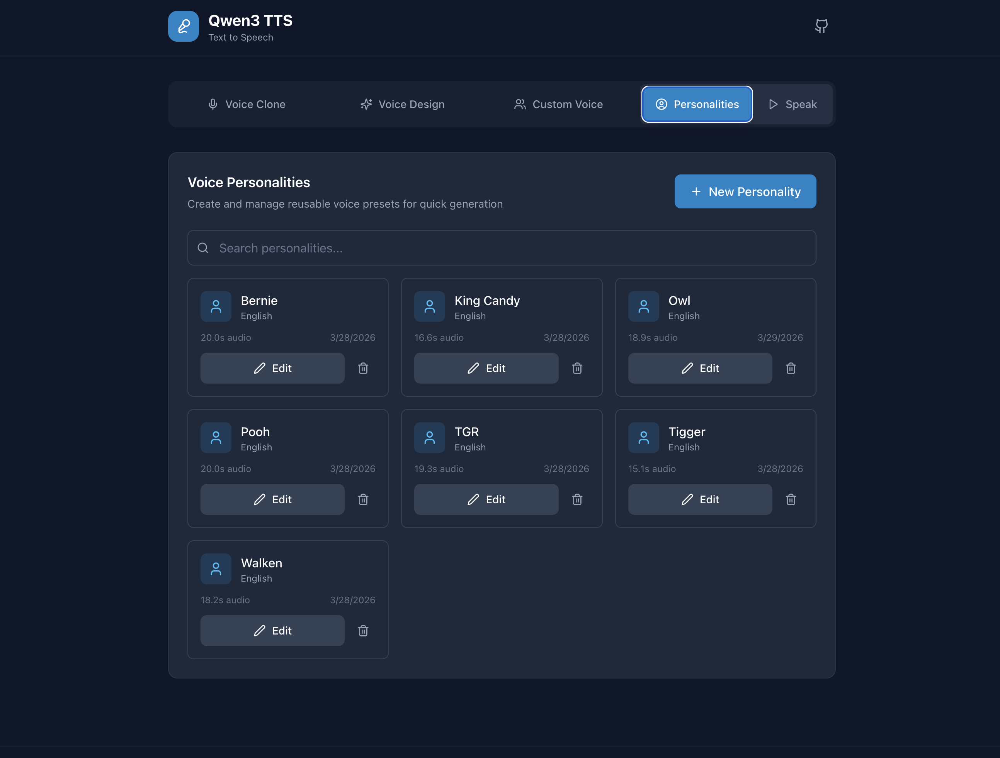
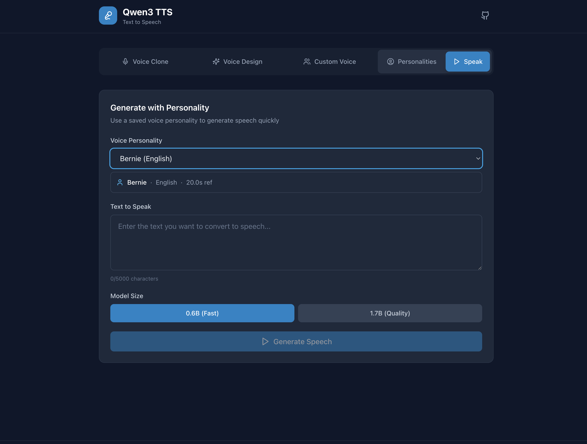

# Qwen3-TTS Web GUI

A simple, lightweight, self-hosted, Docker-deployable web interface for [Qwen3-TTS](https://github.com/QwenLM/Qwen3-TTS) - Alibaba's state-of-the-art text-to-speech model.


## Features

- **Voice Cloning** - Clone any voice from 3-20 seconds of reference audio
- **Voice Design** - Create unique voices from natural language descriptions
- **Custom Voice** - Use 9 preset speakers with emotional control
- **Voice Personalities** - Save and reuse cloned voices for quick generation
- **Audio Editor** - Trim, preview, and auto-transcribe reference audio with waveform visualization
- **Multi-language** - Support for 10 languages (Chinese, English, Japanese, Korean, and more)
- **GPU Accelerated** - CUDA support with FlashAttention for efficient inference
- **Self-hosted** - Full Docker Compose setup for easy deployment

## Screenshots

<table>
  <tr>
    <td align="center">
      
      <br/><b>Voice Clone</b> - Clone any voice from reference audio
    </td>
  </tr>
  <tr>
    <td align="center">
      
      <br/><b>Voice Design</b> - Create voices from text descriptions
    </td>
  </tr>
  <tr>
    <td align="center">
      
      <br/><b>Custom Voice</b> - Use preset speakers with emotional control
    </td>
  </tr>
  <tr>
    <td align="center">
      
      <br/><b>Personalities</b> - Store personality audio snippets
    </td>
  </tr>
  <tr>
    <td align="center">
      
      <br/><b>Personality Speak</b> - User personalities for fast cloning
    </td>
  </tr>
</table>

## Quick Start

### Prerequisites

- Docker with NVIDIA Container Toolkit
- NVIDIA GPU with CUDA support (6GB+ VRAM recommended)

### Deployment

1. **Clone the repository**
   ```bash
   git clone <this-repo>
   cd qwen-tts
   ```

2. **Configure environment**
   ```bash
   cp .env.example .env
   # Edit .env with your preferences
   ```

3. **Start the container**
   ```bash
   docker compose up -d
   ```

4. **Access the web interface**
   ```
   http://localhost:7860
   ```

The first run will download the models (~2-5GB each) which may take several minutes.

## Configuration

### Environment Variables

| Variable | Default | Description |
|----------|---------|-------------|
| `PORT` | `7860` | Web interface port |
| `ENABLED_MODEL_SIZES` | `1.7B` | Which models to enable: `0.6B`, `1.7B`, or `0.6B,1.7B` |
| `CUDA_VISIBLE_DEVICES` | `0` | GPU device ID |
| `USE_FLASH_ATTENTION` | `true` | Enable FlashAttention for memory efficiency |
| `MODEL_PATH` | `./data/models` | HuggingFace model cache |
| `CACHE_PATH` | `./data/cache` | Temporary file cache |
| `OUTPUT_PATH` | `./data/output` | Generated audio output |
| `PERSONALITIES_PATH` | `./data/personalities` | Saved voice personalities |
| `WHISPER_MODEL` | `base` | Whisper model for transcription (tiny/base/small/medium/large-v3) |
| `PUID` / `PGID` | `99` / `100` | User/Group ID for Unraid |
| `TZ` | `America/New_York` | Timezone |

> **Note:** Voice Design mode is only available with the 1.7B model. If you set `ENABLED_MODEL_SIZES=0.6B`, only Voice Clone and Custom Voice will be available.

### Unraid Deployment

This container is designed for easy Unraid deployment using the included template:

1. Download [`qwen-tts.xml`](qwen-tts.xml) from this repository
2. In Unraid, go to Docker tab > Add Container > Template dropdown > select "Add New Template"
3. Choose the downloaded XML file
4. Configure your paths and GPU settings
5. Click Apply

The template includes all configuration options with descriptions, GPU passthrough, and Unraid-optimized defaults (PUID=99, PGID=100).

## Models

### Supported Models

| Model | Size | Mode | VRAM |
|-------|------|------|------|
| Qwen3-TTS-12Hz-1.7B-Base | 4.5GB | Voice Cloning | 6-8GB |
| Qwen3-TTS-12Hz-1.7B-VoiceDesign | 4.5GB | Voice Design | 6-8GB |
| Qwen3-TTS-12Hz-1.7B-CustomVoice | 4.5GB | Custom Voice | 6-8GB |
| Qwen3-TTS-12Hz-0.6B-Base | 2.5GB | Voice Cloning | 4-6GB |
| Qwen3-TTS-12Hz-0.6B-CustomVoice | 2.5GB | Custom Voice | 4-6GB |

> **Note:** Voice Design is only available as a 1.7B model. There is no 0.6B variant.

### Preset Speakers (Custom Voice)

| Speaker | Language | Description |
|---------|----------|-------------|
| Vivian | Chinese | Bright, slightly edgy young female |
| Serena | Chinese | Warm, gentle young female |
| Uncle_Fu | Chinese | Seasoned male, low mellow timbre |
| Dylan | Chinese | Youthful Beijing male, clear timbre |
| Eric | Chinese | Lively Sichuan male, husky brightness |
| Ryan | English | Dynamic male, strong rhythmic drive |
| Aiden | English | Sunny American male, clear midrange |
| Ono_Anna | Japanese | Playful female, light timbre |
| Sohee | Korean | Warm female, rich emotion |

## Usage

### Voice Cloning

1. Upload a reference audio file (3-20 seconds, clear speech)
2. Enter the exact transcript of the reference audio
3. Enter the text you want to synthesize
4. Select language and model size
5. Click Generate

### Voice Design

1. Enter the text to synthesize
2. Describe the voice you want (e.g., "Deep male voice, mid-40s, authoritative but friendly")
3. Select language
4. Click Generate

### Custom Voice

1. Enter the text to synthesize
2. Select a preset speaker
3. Optionally add style instructions (e.g., "Speak with enthusiasm")
4. Select language and model size
5. Click Generate

### Personalities (Voice Presets)

Create reusable voice personalities from audio samples for consistent voice cloning without re-uploading reference audio each time.

#### Creating a Personality

1. Navigate to the **Personalities** tab
2. Click **New Personality**
3. Enter a name and optional description
4. Select the language for this voice
5. Upload a reference audio clip (3-20 seconds, clear speech)
6. Use the waveform editor to trim if needed
7. Click **Auto-Transcribe** to generate transcript, or enter manually
8. Click **Create Personality**

#### Generating with Personalities

1. Navigate to the **Generate** tab (with Play icon)
2. Select a personality from the dropdown
3. Enter the text you want to generate
4. Choose model size (0.6B faster, 1.7B higher quality)
5. Click Generate
6. Download or play the result

#### Whisper Transcription

Audio transcription uses faster-whisper. Configure the model size via `WHISPER_MODEL`:

| Model | Size | Speed | Accuracy |
|-------|------|-------|----------|
| tiny | ~75MB | Fastest | Basic |
| base | ~150MB | Fast | Good (default) |
| small | ~500MB | Medium | Better |
| medium | ~1.5GB | Slow | High |
| large-v3 | ~3GB | Slowest | Best |

#### Storage

Personalities are stored in the mounted volume at `PERSONALITIES_PATH` (default: `./data/personalities/`). Each personality has its own folder containing metadata, audio, and transcript files.

## API

The backend exposes a REST API:

```
# Generation
POST /api/generate/clone        - Voice cloning (multipart form)
POST /api/generate/design       - Voice design (JSON)
POST /api/generate/custom       - Custom voice (JSON)
POST /api/generate/personality  - Generate with saved personality (multipart form)

# Personalities
GET    /api/personalities              - List all personalities
POST   /api/personalities              - Create personality (multipart form)
GET    /api/personalities/{id}         - Get personality details
PATCH  /api/personalities/{id}         - Update personality metadata (JSON)
PUT    /api/personalities/{id}/audio   - Update personality audio (multipart form)
DELETE /api/personalities/{id}         - Delete personality
GET    /api/personalities/{id}/audio   - Get personality reference audio

# Transcription
POST /api/transcribe            - Transcribe audio with Whisper (multipart form)

# Utility
GET  /api/audio/{filename}      - Download generated audio
GET  /api/health                - Health check
GET  /api/models                - List available models
GET  /api/speakers              - Get preset speakers
GET  /api/languages             - Get supported languages
```

## Development

### Local Development

```bash
# Backend
cd backend
pip install -r requirements.txt
python main.py

# Frontend (separate terminal)
cd frontend
npm install
npm run dev
```

### Building

```bash
docker compose build
```

## Troubleshooting

### Out of Memory

- Use the 0.6B model instead of 1.7B
- Ensure `USE_FLASH_ATTENTION=true`
- Increase Docker shared memory: `shm_size: '8gb'`

### Slow First Generation

Models are downloaded on first use. Subsequent generations will be faster.

### No GPU Detected

1. Verify NVIDIA Container Toolkit is installed
2. Check `nvidia-smi` works on host
3. Ensure `runtime: nvidia` is in docker-compose.yml

## Credits

- [Qwen3-TTS](https://github.com/QwenLM/Qwen3-TTS) by Alibaba Cloud
- [HuggingFace](https://huggingface.co/collections/Qwen/qwen3-tts) for model hosting

## License

This project is for personal/research use. The Qwen3-TTS models have their own license terms - please review them before commercial use.
